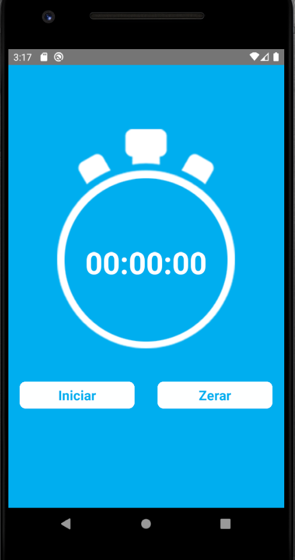
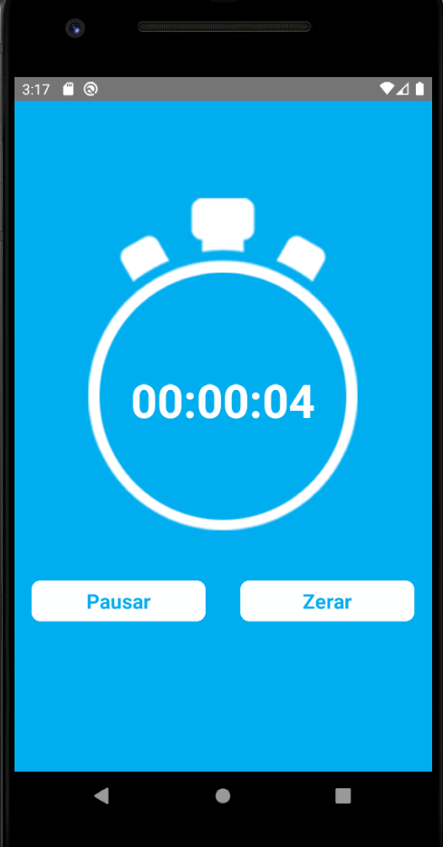
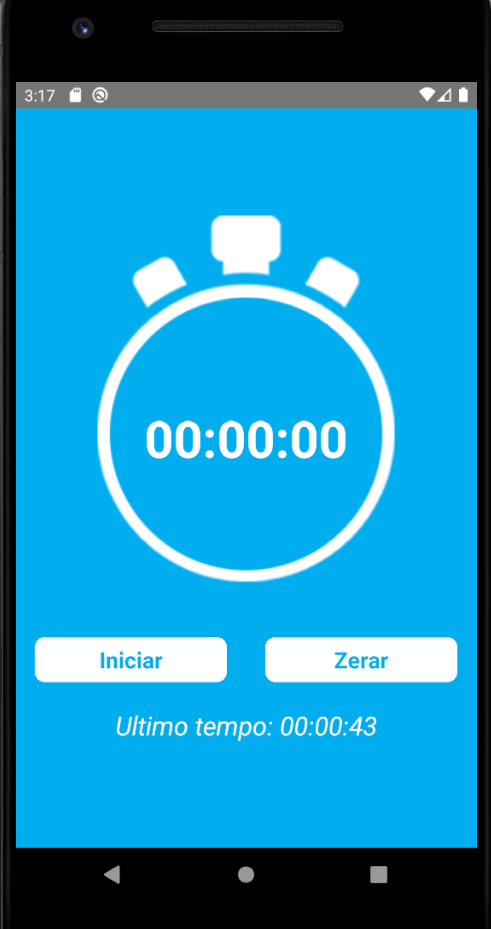

# ⏱️ Cronômetro

<div align="center">
  <strong>⏳ Um app simples para medir o tempo com funcionalidades de iniciar, pausar e zerar!</strong>
</div>

## 🎯 Objetivo do Projeto

Este aplicativo foi criado para praticar conceitos fundamentais do React Native, incluindo:

- 📌 **Text** (exibição de texto)
- 📌 **View** (estruturação de layout)
- 📌 **Image** (exibição de imagens)
- 📌 **TouchableOpacity** (botões interativos)
- 📌 **useState** (gerenciamento de estado no React Native)
- 📌 **setInterval** (manipulação de tempo)
- 📌 **StyleSheet** (estilização de componentes)

## 🛠️ Pré-requisitos

Antes de começar, certifique-se de ter instalado em sua máquina:

- Node.js
- React Native CLI
- Android Studio
- JDK8

## 📌 Funcionalidades

- **Iniciar o cronômetro**: Começa a contagem do tempo.
- **Pausar o cronômetro**: Pausa a contagem do tempo.
- **Zerar o tempo**: Reinicia o cronômetro para zero.
- **Exibir o último tempo registrado**: Mostra o último tempo marcado antes de zerar.

## 🎨 Tecnologias utilizadas

- React Native
- TypeScript
- Android Studio
- Node.js

---

# 🚀 Como executar o projeto

Siga os passos abaixo para rodar o projeto em sua máquina:

## 📥 Clone o repositório:
```bash
git clone https://github.com/seu-usuario/AppCronometro.git 
````

## 📂 Navegue até a pasta do projeto:
```bash
cd AppCronometro
````

## 📦 Instale as dependências:
```bash
npm install 
````

## ▶️ Execute o projeto:

### Para Android:
```bash
npx react-native run-android
```

### Para iOS::
```bash
npx react-native run-ios
```
## 📸 Capturas de Tela
<div align="center">
  
  
  
</div>

### Estrutura do Projeto

- **`App.tsx`**: Contém a lógica principal do cronômetro, incluindo a manipulação do tempo e a interface do usuário.
- **`src/crono.png`**: Imagem do ícone do cronômetro.
- **`styles`**: Estilização dos componentes usando `StyleSheet`.

### Código Explicado

O cronômetro funciona com base em três estados principais:

1. **`numero`**: Armazena o tempo atual no formato `HH:MM:SS`.
2. **`botao`**: Controla o texto do botão (Iniciar, Pausar, Continuar).
3. **`ultimo`**: Armazena o último tempo registrado antes de zerar.

A lógica do cronômetro é implementada usando `setInterval` para atualizar o tempo a cada segundo.

